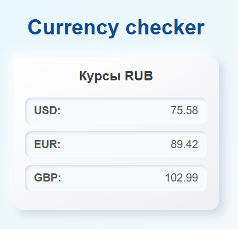

# 💱 Currency Checker
Приложение для отслеживания курсов валют (USD, EUR, GBP → RUB) с:
- backend-сервером на **Node.js + Express + TypeScript**
- периодическим обновлением курсов через **ExchangeRate API**
- уведомлениями в **Telegram**, если курс изменился больше заданного порога
- frontend-виджетом на **React + Vite + TypeScript**



---

## ✨ Возможности

📈 Получение актуальных курсов валют  
🔔 Уведомления в Telegram при изменении курса  
💾 Кэширование последних курсов в `rates.json`  
🌐 API endpoint `/rates` для фронтенда  
🖥️ UI-виджет для отображения курсов  
⚙️ Настройка через `.env`  

---

## Телеграм уведомления
Бот отправляет сообщение, если изменение курса превышает THRESHOLD
Проверка курсов выполняется по таймеру (setInterval)
Уведомления приходят только когда backend запущен
Пример сообщения:
```
Превышена дельта 1 руб.:
USD: 75.58 → 77.10 руб.
Разница: +1.52 руб.
```

## Запуск проекта локально
1. Склонировать репозиторий и перейти в проект
```
git clone https://github.com/your-username/currency-checker.git
cd currency-checker
```

2. Настроить окружение
Создать файл .env в папке backend
Указать переменные:
```
TG_TOKEN=your_telegram_bot_token
CHAT_ID=your_chat_id
API_KEY=your_exchangerate_api_key
THRESHOLD=1
```

3. Установить и запустить бэкенд
```
cd backend
npm i
npm run start
```
Бэкенд будет доступен по адресу: http://localhost:3001

4. Установить и запустить фронтенд
```
cd ..
сd frontend
npm i
npm run dev
```
Фронтенд будет доступен по адресу: http://localhost:5173